# DSO303 Lab 1 — AWS IAM Policy Testing with Floci

**Student Name:** Dupchu Wangmo  
**Student Number:** 02230282  
**Course:** DSO303  
**Lab:** Lab 1 — IAM  


## 1. Introduction

This practical involved learning and implementing AWS Identity and Access Management (IAM) concepts through the use of Floci local AWS-compatible infrastructure.

The key objectives of the practical included:

- Setting up Floci AWS infrastructure with Docker.
- Configuring AWS CLI to connect to Floci.
- Creating an IAM group and IAM user.
- Adding IAM user to the IAM group.
- Creating a customer-managed IAM policy.
- Attaching policy to the IAM group.
- Checking whether user gets permissions via group.
- Performing both allowed and denied S3 operations.
- Creating an S3 bucket to perform the tests.
- Validating IAM permissions using AWS IAM policy simulation.
- Keeping practical documentation through screen captures and Git.

The practical was performed on macOS operating system using Docker, Floci, and AWS CLI.


# 2. Environment Setup

## 2.1 Tools Used

The following tools were used during the practical:

- macOS
- Docker Desktop
- Docker Compose
- Floci AWS
- AWS CLI
- Git
- GitHub

The Floci server used during the practical was:

- **Floci image:** `floci/floci:latest`
- **Floci server version:** `1.5.34`
- **AWS region:** `us-east-1`
- **AWS account ID:** `000000000000`
- **Floci endpoint:** `http://localhost:4566`


## 2.2 Floci Storage Configuration

The Floci storage environment variables were configured as follows:

```bash
FLOCI_STORAGE_MODE=hybrid
FLOCI_STORAGE_PERSISTENT_PATH=/app/data
FLOCI_STORAGE_HOST_PERSISTENT_PATH=/Users/dupchuuw/floci-data
````

The configuration was loaded using:

```bash
source configs/course.env
```

The values were verified using:

```bash
echo "$FLOCI_STORAGE_MODE"
echo "$FLOCI_STORAGE_PERSISTENT_PATH"
echo "$FLOCI_STORAGE_HOST_PERSISTENT_PATH"
```

The output confirmed:

```text
hybrid
/app/data
/Users/dupchuuw/floci-data
```

### Screenshot Evidence

> **Screenshot 1 — Floci storage environment variables**

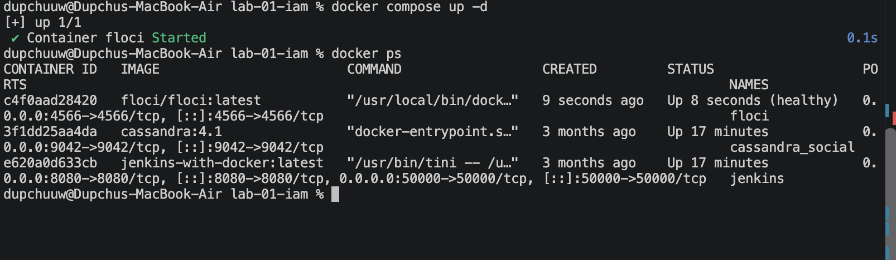

# 3. Docker Compose Configuration

Initially, Docker Compose produced an error because the Floci storage environment variables were not available to Docker Compose.

The error was:

```text
invalid spec: :/app/data: empty section between colons
```

This occurred because the following variables were empty:

```text
FLOCI_STORAGE_MODE
FLOCI_STORAGE_PERSISTENT_PATH
FLOCI_STORAGE_HOST_PERSISTENT_PATH
```

The variables were exported:

```bash
export FLOCI_STORAGE_MODE=hybrid
export FLOCI_STORAGE_PERSISTENT_PATH=/app/data
export FLOCI_STORAGE_HOST_PERSISTENT_PATH="$HOME/floci-data"
```

After exporting the variables, the Docker Compose configuration was successfully validated.

The command used was:

```bash
docker compose config
```

The resulting configuration showed:

```text
source: /Users/dupchuuw/floci-data
target: /app/data
```

and port `4566` was mapped correctly.

### Screenshot Evidence

> **Screenshot 2 — Successful Docker Compose configuration**

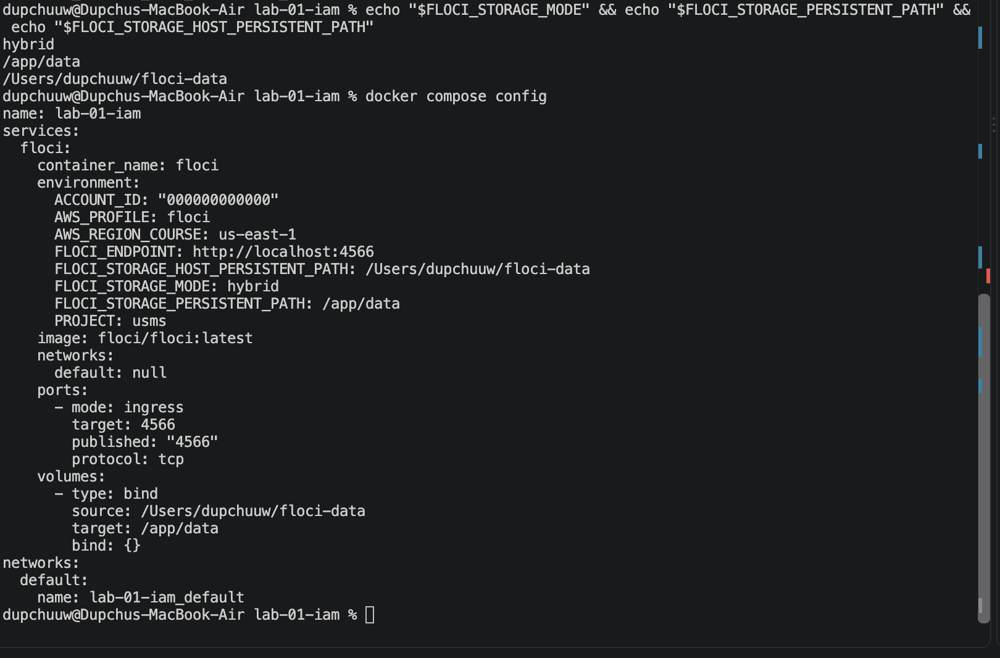

# 4. Starting Floci

The Floci container was started using Docker Compose.

```bash
docker compose up -d
```

An initial container-name conflict occurred because a container named `floci` already existed.

The error was:

```text
Conflict. The container name "/floci" is already in use
```

After resolving the existing container, Floci was successfully started.

The container was verified using:

```bash
docker ps
```

The output showed the Floci container running and healthy:

```text
floci/floci:latest
Up ... (healthy)
0.0.0.0:4566->4566/tcp
```

### Screenshot Evidence

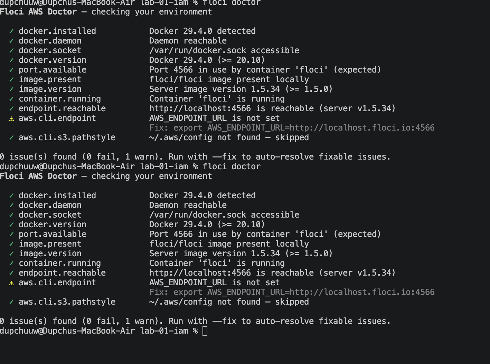


# 5. Floci Environment Verification

The Floci environment was checked using:

```bash
floci doctor
```

The diagnostic confirmed:

* Docker installed.
* Docker daemon reachable.
* Docker socket accessible.
* Correct Docker version.
* Port `4566` available/in use as expected.
* Floci image available.
* Floci version `1.5.34`.
* Floci container running.
* Floci endpoint reachable.
* AWS CLI endpoint configured.

The final diagnostic reported:

```text
0 issue(s) found (0 fail, 1 warn)
```

The remaining warning concerned the S3 path-style configuration:

```text
~/.aws/config missing 's3.addressing_style = path'
```

This warning did not prevent the IAM and S3 operations used in the practical from working.

### Screenshot Evidence

> **Screenshot 4 — Floci Doctor verification**

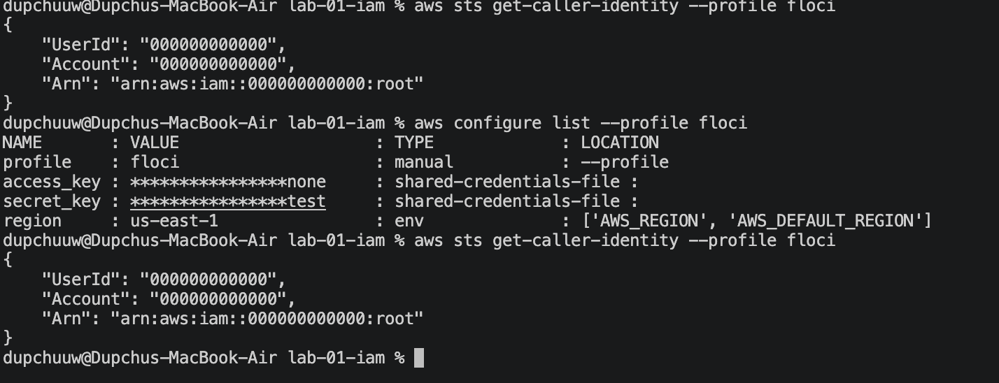

# 6. AWS CLI Configuration

The AWS CLI was configured to communicate with the local Floci environment.

The endpoint was configured as:

```bash
export AWS_ENDPOINT_URL=http://localhost:4566
```

The default region was:

```bash
export AWS_DEFAULT_REGION=us-east-1
```

The Floci AWS CLI profile was configured with test credentials.

The AWS CLI configuration was checked using:

```bash
aws configure list --profile floci
```

The configuration showed:

```text
profile    : floci
access_key : ****************test
secret_key : ****************test
region     : us-east-1
```


# 7. Verifying AWS Identity

The AWS identity was checked using:

```bash
aws sts get-caller-identity --profile floci
```

The output was:

```json
{
    "UserId": "000000000000",
    "Account": "000000000000",
    "Arn": "arn:aws:iam::000000000000:root"
}
```

This confirmed that the AWS CLI was communicating with the Floci environment.

### Screenshot Evidence

> **Screenshot 5 — AWS STS caller identity**


# 8. Initial IAM State

Before creating the IAM resources, the existing users and groups were checked.

The command:

```bash
aws iam list-users --profile floci
```

initially returned:

```json
{
    "Users": []
}
```

The command:

```bash
aws iam list-groups --profile floci
```

returned:

```json
{
    "Groups": []
}
```

This confirmed that the Floci IAM environment started without the required lab users and groups.

### Screenshot Evidence

> **Screenshot 6 — Initial IAM users and groups**

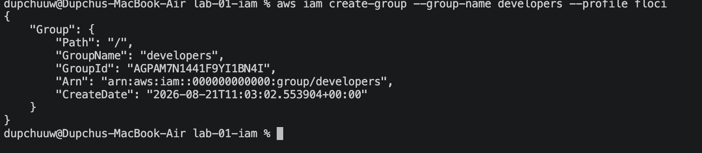

# 9. Creating the Developers Group

The IAM group named `developers` was created using:

```bash
aws iam create-group --group-name developers --profile floci
```

The group was successfully created.

The group was then verified using:

```bash
aws iam get-group --group-name developers --profile floci
```

The output confirmed:

```text
GroupName: developers
GroupId: AGPA3QWB5NOPEVOIWY2Y
Arn: arn:aws:iam::000000000000:group/developers
```

### Screenshot Evidence

> **Screenshot 7 — Developers group created**

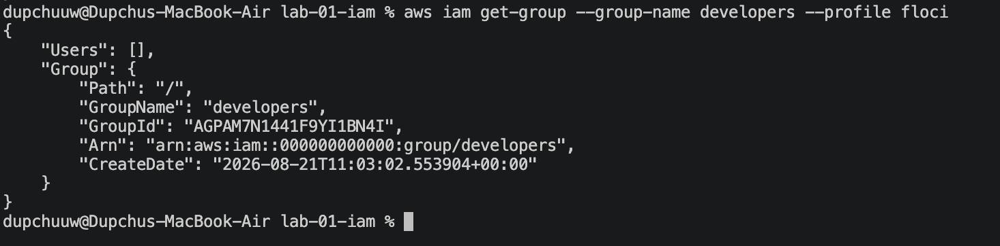

# 10. Creating the Lab Developer User

The IAM user `lab-developer` was created using:

```bash
aws iam create-user --user-name lab-developer --profile floci
```

The user was successfully created.

The user ARN was:

```text
arn:aws:iam::000000000000:user/lab-developer
```

The user was then added to the `developers` group:

```bash
aws iam add-user-to-group \
  --user-name lab-developer \
  --group-name developers \
  --profile floci
```

The group membership was verified using:

```bash
aws iam get-group \
  --group-name developers \
  --profile floci
```

The output confirmed that:

```text
lab-developer
```

was a member of:

```text
developers
```

### Screenshot Evidence

> **Screenshot 8 — User added to developers group**

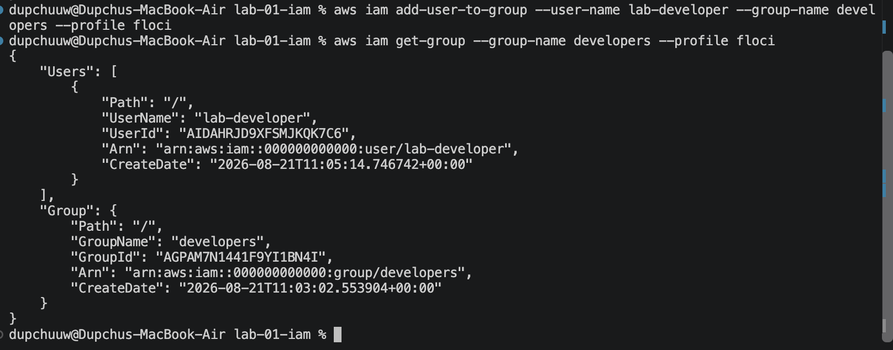

# 11. Creating the DeveloperReadOnly Policy

A customer-managed policy named `DeveloperReadOnly` was created.

The policy document was stored in:

```text
policies/developer-readonly.json
```

The policy contained:

```json
{
  "Version": "2012-10-17",
  "Statement": [
    {
      "Effect": "Allow",
      "Action": [
        "s3:ListAllMyBuckets",
        "s3:GetBucketLocation",
        "s3:ListBucket"
      ],
      "Resource": "*"
    }
  ]
}
```

The policy allows the following S3 operations:

| Permission             | Purpose                      |
| ---------------------- | ---------------------------- |
| `s3:ListAllMyBuckets`  | List available S3 buckets    |
| `s3:GetBucketLocation` | Retrieve bucket location     |
| `s3:ListBucket`        | List objects within a bucket |

The policy does **not** grant:

```text
s3:PutObject
```

Therefore, object uploads should be denied for the `lab-developer` user.


# 12. Creating the IAM Policy

The policy was created using:

```bash
aws iam create-policy \
  --policy-name DeveloperReadOnly \
  --policy-document file://policies/developer-readonly.json \
  --profile floci
```

The policy was successfully created with:

```text
PolicyName: DeveloperReadOnly
PolicyId: ANPAIKBI261XF335FUX3
Arn: arn:aws:iam::000000000000:policy/DeveloperReadOnly
```

The policy was verified using:

```bash
aws iam list-policies --scope Local --profile floci
```


# 13. Attaching the Policy to the Developers Group

The policy was attached to the `developers` group using:

```bash
aws iam attach-group-policy \
  --group-name developers \
  --policy-arn arn:aws:iam::000000000000:policy/DeveloperReadOnly \
  --profile floci
```

The attachment was verified using:

```bash
aws iam list-attached-group-policies \
  --group-name developers \
  --profile floci
```

The output showed:

```text
PolicyName: DeveloperReadOnly
PolicyArn: arn:aws:iam::000000000000:policy/DeveloperReadOnly
```

This demonstrated that the policy was attached to the group rather than directly to the user.

### Screenshot Evidence

> **Screenshot 10 — DeveloperReadOnly attached to developers group**


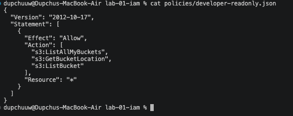


# 14. Verifying the Policy Document

The policy metadata was checked using:

```bash
aws iam get-policy \
  --policy-arn arn:aws:iam::000000000000:policy/DeveloperReadOnly \
  --profile floci
```

The policy version was then retrieved using:

```bash
aws iam get-policy-version \
  --policy-arn arn:aws:iam::000000000000:policy/DeveloperReadOnly \
  --version-id v1 \
  --profile floci
```

The returned policy confirmed that the allowed actions were:

```text
s3:ListAllMyBuckets
s3:GetBucketLocation
s3:ListBucket
```

### Screenshot Evidence

> **Screenshot 11 — DeveloperReadOnly policy permissions**


# 15. Verifying No Direct User Policy

The user's directly attached policies were checked using:

```bash
aws iam list-attached-user-policies \
  --user-name lab-developer \
  --profile floci
```

The output was:

```json
{
    "AttachedPolicies": []
}
```

The inline policies were also checked:

```bash
aws iam list-user-policies \
  --user-name lab-developer \
  --profile floci
```

The result was:

```json
{
    "PolicyNames": []
}
```

This confirmed that the permissions were inherited from the `developers` group.

### Screenshot Evidence

> **Screenshot 12 — No direct policies attached to lab-developer**


# 16. IAM Policy Simulation

IAM policy simulation was used to verify the effective permissions of the `lab-developer` user.

The user's policy source ARN was:

```text
arn:aws:iam::000000000000:user/lab-developer
```

## 16.1 Testing ListAllMyBuckets

The following command was used:

```bash
aws iam simulate-principal-policy \
  --policy-source-arn arn:aws:iam::000000000000:user/lab-developer \
  --action-names s3:ListAllMyBuckets \
  --profile floci
```

The result was:

```text
EvalDecision: allowed
```

Therefore:

```text
s3:ListAllMyBuckets = ALLOWED
```


## 16.2 Testing ListBucket

The following command was used:

```bash
aws iam simulate-principal-policy \
  --policy-source-arn arn:aws:iam::000000000000:user/lab-developer \
  --action-names s3:ListBucket \
  --profile floci
```

The result was:

```text
EvalDecision: allowed
```

Therefore:

```text
s3:ListBucket = ALLOWED
```


## 16.3 Testing PutObject

The following command was used:

```bash
aws iam simulate-principal-policy \
  --policy-source-arn arn:aws:iam::000000000000:user/lab-developer \
  --action-names s3:PutObject \
  --profile floci
```

The result was:

```text
EvalDecision: implicitDeny
```

Therefore:

```text
s3:PutObject = IMPLICIT DENY
```

This demonstrates that the `DeveloperReadOnly` policy provides read/list access but does not provide permission to upload objects.

### Screenshot Evidence

> **Screenshot 13 — IAM policy simulation showing allowed and denied actions**

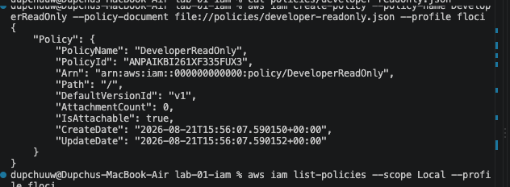

# 17. Access Key Testing

An access key was temporarily created for the `lab-developer` user.

The command used was:

```bash
aws iam create-access-key \
  --user-name lab-developer \
  --profile floci
```

The key was successfully created and shown as:

```text
Status: Active
```

The key was verified using:

```bash
aws iam list-access-keys \
  --user-name lab-developer \
  --profile floci
```

The access key was then used to verify the identity:

```bash
aws sts get-caller-identity
```

The result identified the principal as:

```text
arn:aws:iam::000000000000:user/lab-developer
```

This confirmed that the AWS CLI was operating as the IAM user when the temporary credentials were active.

> **Security Note:** Secret access keys should never be included in the final report, Git repository, screenshots, or public GitHub repository.

### Screenshot Evidence

> **Screenshot 14 — lab-developer identity verification**

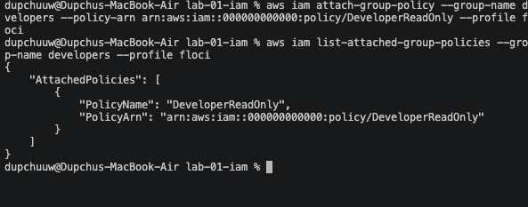

# 18. Access Key Cleanup

The temporary access key was later removed.

The final verification:

```bash
aws iam list-access-keys \
  --user-name lab-developer \
  --profile floci
```

returned:

```json
{
    "AccessKeyMetadata": []
}
```

This confirmed that there were no remaining access keys for the `lab-developer` user.

### Screenshot Evidence

> **Screenshot 15 — Access key cleanup**

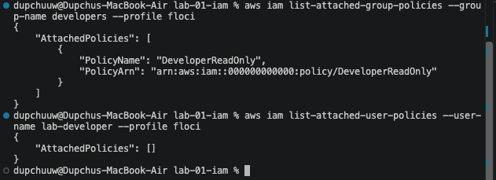

# 19. Creating the S3 Test Bucket

An S3 bucket named:

```text
usms-iam-test
```

was created using:

```bash
aws s3api create-bucket \
  --bucket usms-iam-test \
  --profile floci
```

The result confirmed:

```text
Location: /usms-iam-test
```

The bucket was then verified using:

```bash
aws s3api list-buckets --profile floci
```

The output showed:

```text
usms-iam-test
```

### Screenshot Evidence

> **Screenshot 16 — S3 test bucket created**


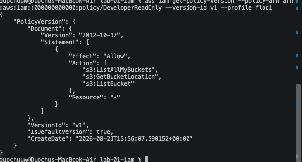

# 20. Listing Objects in the S3 Bucket

The bucket contents were checked using:

```bash
aws s3api list-objects-v2 \
  --bucket usms-iam-test \
  --profile floci
```

The result initially showed no objects:

```json
{
    "RequestCharged": null,
    "Prefix": ""
}
```

This confirmed that the bucket was initially empty.

### Screenshot Evidence

> **Screenshot 17 — Empty S3 bucket**

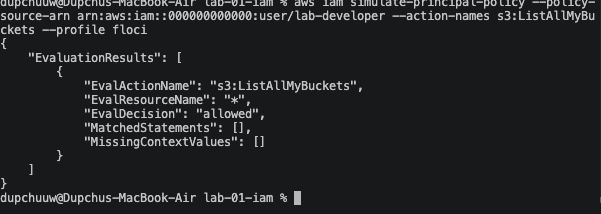

# 21. S3 Object Upload Test

A test file was created:

```bash
echo "IAM lab test" > /tmp/iam-test.txt
```

The file was uploaded using:

```bash
aws s3 cp \
  /tmp/iam-test.txt \
  s3://usms-iam-test/iam-test.txt \
  --profile floci
```

The upload returned:

```text
upload: .../tmp/iam-test.txt to s3://usms-iam-test/iam-test.txt
```

This test was performed while using the root/administrative Floci credentials rather than the restricted `lab-developer` credentials.

Therefore, this upload does **not** contradict the IAM simulation result showing that `lab-developer` has an implicit deny for `s3:PutObject`.

The policy simulation is the evidence used to demonstrate the restricted user's permissions.

### Screenshot Evidence

> **Screenshot 18 — S3 object upload test**

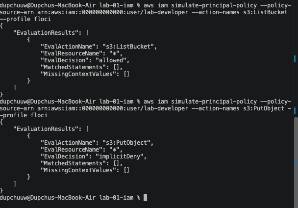

# 22. Floci Restart and IAM State Reset

During the practical, the Floci container was stopped and later restarted.

After the restart, the previously created IAM resources were no longer present.

The following command:

```bash
aws iam list-groups --profile floci
```

returned:

```json
{
    "Groups": []
}
```

Similarly:

```bash
aws iam list-users --profile floci
```

returned:

```json
{
    "Users": []
}
```

The `developers` group therefore had to be recreated.

This was an important troubleshooting observation because the IAM resources created before the Floci restart were not available after the environment reset.


# 23. Recreating the IAM Resources

After restarting Floci, the IAM resources were recreated.

## 23.1 Developers Group

```bash
aws iam create-group \
  --group-name developers \
  --profile floci
```

The group was successfully recreated.


## 23.2 Lab Developer User

```bash
aws iam create-user \
  --user-name lab-developer \
  --profile floci
```

The user was successfully recreated.


## 23.3 Adding User to Group

```bash
aws iam add-user-to-group \
  --user-name lab-developer \
  --group-name developers \
  --profile floci
```

The group membership was verified using:

```bash
aws iam get-group \
  --group-name developers \
  --profile floci
```

The output confirmed:

```text
GroupName: developers
UserName: lab-developer
```

### Screenshot Evidence

> **Screenshot 19 — Recreated developers group and lab-developer user**

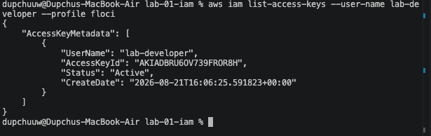


# 24. Final IAM Structure

The final IAM structure established during the practical is:

```text
AWS Account
│
└── developers
    │
    ├── lab-developer
    │
    └── DeveloperReadOnly
        │
        ├── s3:ListAllMyBuckets
        ├── s3:GetBucketLocation
        └── s3:ListBucket
```

The user does not have a direct policy.

Instead, the policy is attached to the group, and the user receives its permissions through group membership.


# 25. Permission Summary

| IAM Action             | Expected Result |
| ---------------------- | --------------- |
| `s3:ListAllMyBuckets`  | Allowed         |
| `s3:GetBucketLocation` | Allowed         |
| `s3:ListBucket`        | Allowed         |
| `s3:PutObject`         | Implicit Deny   |

The IAM policy simulation confirmed the important permission boundaries:

```text
s3:ListAllMyBuckets → allowed
s3:ListBucket       → allowed
s3:PutObject        → implicitDeny
```

This demonstrates the principle of least privilege because the developer user receives only the S3 permissions required by the policy.


# 29. Troubleshooting

Several issues were encountered during the practical.

## 30.1 Docker Compose Empty Environment Variables

Initially:

```text
invalid spec: :/app/data: empty section between colons
```

### Cause

The Floci storage variables were not exported into the shell environment used by Docker Compose.

### Solution

```bash
export FLOCI_STORAGE_MODE=hybrid
export FLOCI_STORAGE_PERSISTENT_PATH=/app/data
export FLOCI_STORAGE_HOST_PERSISTENT_PATH="$HOME/floci-data"
```

After this, `docker compose config` completed successfully.


## 30.2 Container Name Conflict

Docker reported:

```text
Conflict. The container name "/floci" is already in use
```

### Cause

A previous Floci container named `floci` already existed.

### Solution

The existing container was handled and Floci was started successfully.


## 30.3 Invalid AWS Token

At one point, the AWS CLI returned:

```text
InvalidClientTokenId
```

### Cause

The configured credentials did not match the currently running Floci environment.

### Solution

The Floci environment was restarted and the AWS CLI was reconfigured with the local test credentials.


## 30.4 Floci Endpoint Not Reachable

The AWS CLI initially returned:

```text
Could not connect to the endpoint URL
```

The cause was that the Floci container was stopped.

The issue was identified using:

```bash
docker ps --filter name=floci
```

and:

```bash
floci doctor
```

The Floci container was restarted with:

```bash
floci start
```

After restarting, `floci doctor` confirmed:

```text
container.running ✓
endpoint.reachable ✓
```

## 30.5 IAM Resources Missing After Restart

After restarting Floci, the following returned empty results:

```bash
aws iam list-groups --profile floci
```

and:

```bash
aws iam list-users --profile floci
```

This meant that the IAM resources created previously were no longer available.

The `developers` group and `lab-developer` user were recreated.


# 31. Learning Outcomes

This practical exercise was used as a chance to gain hands-on experience in working with AWS IAM and Access Control.

The learning objectives were:

1. Familiarity with IAM users and groups.
2. Familiarity with how IAM groups give permission.
3. Creation of customer-created IAM policies.
4. Attachments of policies to IAM groups.
5. Verification of IAM permission effectiveness.
6. Familiarity with how explicit permission is different from implicit denial.
7. IAM permission verification by policy simulation.
8. Working with AWS CLI on a local AWS environment.
9. Verification of S3 permission.
10. Temporary access credential management.
11. Docker and Floci environment troubleshooting.
12. Use of Git and GitHub for practical exercise.


# 32. Conclusion

This IAM practical for DSO303 showed how IAM in AWS can be used to control the access to the AWS resources by creating users, groups, and policies.

`developers` group was created and the `lab-developer` user was added to the group. Customer managed policy `DeveloperReadOnly` was created and applied to the group. The policy allowed s3 listing permissions but explicitly excluded `s3:PutObject`.

Policy evaluation showed that

```text
s3:ListAllMyBuckets → allowed
s3:ListBucket       → allowed
s3:PutObject        → implicitDeny
```

That means that permissions were inherited via the IAM group and there were no unnecessary object upload permissions for the user.

This practice session also gave some hands-on experience in Floci troubleshooting, Docker compose, AWS cli configuration, credentials management, testing S3 and Git version control usage.

In general, this practical helped to better understand the role of IAM in implementation of least privilege access control.