 # Lab 02 Report: Virtual Private Cloud and Networking
 

## 1. Introduction

A network architecture was created to provide a strong network foundation for the USMS using AWS CLI and Floci emulator software. This architecture keeps the web tier separate from the database tier, ensures that there is public access only when necessary, and allows restricted outbound access to private resources.

Some of the objectives of this lab were to provision a VPC, subnets, route tables, Internet gateway, security groups, network ACL, NAT gateway, and an Amazon S3 gateway endpoint.

## 2. Environment and Prerequisites

The lab was completed using:

- AWS CLI with the `floci` profile
- Floci running through Docker Compose
- `FLOCI_STORAGE_MODE=hybrid`
- Region: `us-east-1`
- Account: `000000000000`
- Project: `USMS`

The environment was checked before creating resources. The storage check confirmed that Floci was running with persistent storage rather than memory-only storage.

### Screenshot 1: Environment check

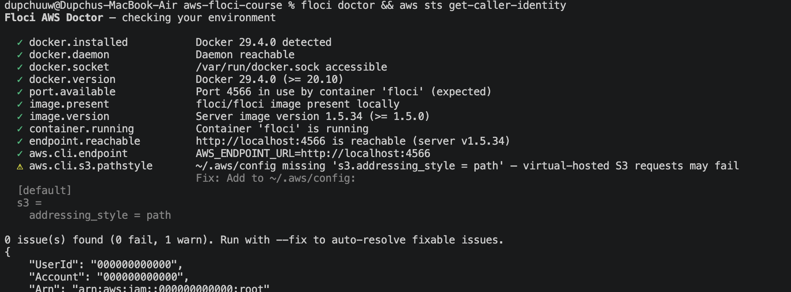

## 3. Network Architecture

The network uses the address range `10.0.0.0/16`. The subnets were divided as follows:

| Resource | CIDR | Availability Zone | Purpose |
|---|---|---|---|
| `usms-public-subnet-a` | `10.0.1.0/24` | `us-east-1a` | Public web tier |
| `usms-public-subnet-b` | `10.0.2.0/24` | `us-east-1b` | Public web tier and availability |
| `usms-private-subnet-a` | `10.0.3.0/24` | `us-east-1a` | Private database tier |
| `usms-private-subnet-b` | `10.0.4.0/24` | `us-east-1b` | Private database tier and availability |
| `usms-public-subnet-c` | `10.0.5.0/24` | `us-east-1c` | Exercise 1 practice subnet; removed later |

The public subnets use `usms-public-rt`, whose default route points to `usms-igw`. The private subnets use `usms-private-rt`, whose default route points to `usms-nat`. The S3 gateway endpoint is also associated with the private route table.

## 4. Implementation Summary

### 4.1 VPC and DNS

The VPC `usms-vpc` was created with CIDR `10.0.0.0/16`. DNS support and DNS hostnames were enabled so that resources in the VPC can use DNS-based service names and public DNS hostnames where applicable.

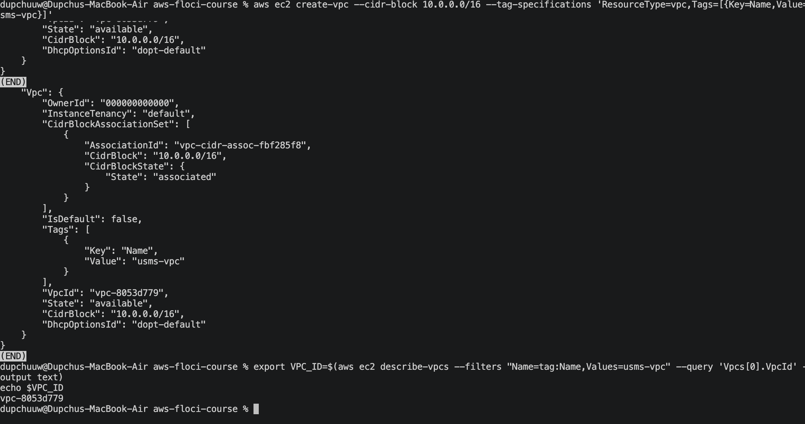

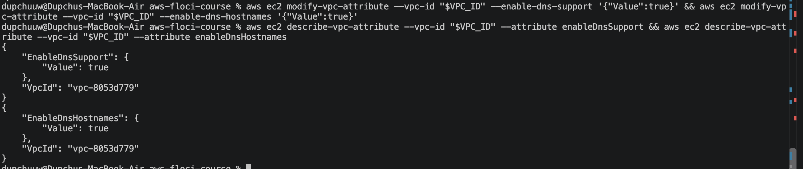


### 4.2 Internet Gateway and Subnets

Internet gateway usms-igw was set up and associated with the VPC. Public Subnet A was set up to automatically assign public IPv4 addresses. Public Subnet B was set up in the second AZ. Private subnets did not automatically assign any public IP addresses.

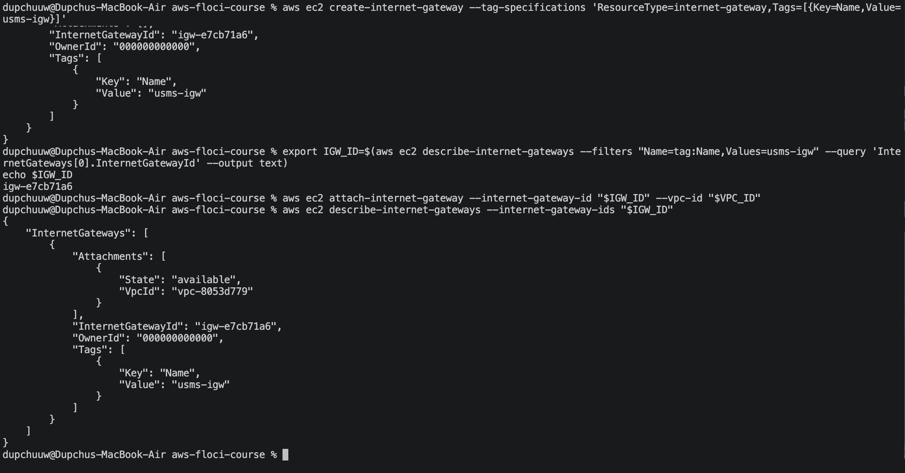

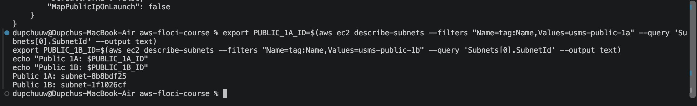

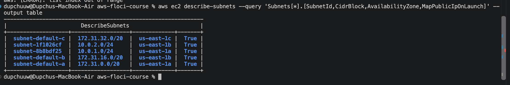

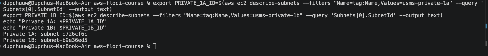

### 4.3 Route Tables

The public route table contains the local VPC route and a default route:

```text
0.0.0.0/0 -> usms-igw
```

The private route table initially contained only the local route. After the NAT gateway was created, its default route became:

```text
0.0.0.0/0 -> usms-nat
```

This proves that a subnet is public because of its effective route to an internet gateway, not because of its name, tag, or public-IP setting.

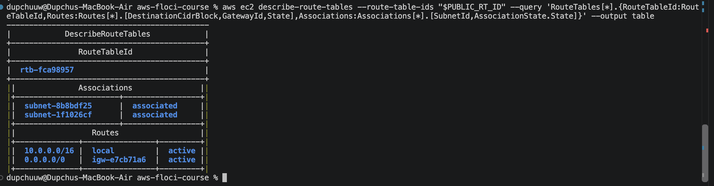


### 4.4 Security Groups

The application security group `usms-app-sg` was configured for:

| Protocol | Port | Source | Purpose |
|---|---:|---|---|
| TCP | 80 | `0.0.0.0/0` | Public HTTP access |
| TCP | 443 | `0.0.0.0/0` | Public HTTPS access |
| TCP | 22 | `10.0.0.0/16` or the bastion group where applicable | Restricted administration |

Database security group `usms-db-sg` is allowing TCP port `5432` access through security-group reference from `usms-app-sg`, not through fixed subnet CIDR notation. It still works even when application instances are shifted and scaled across VPC.

Security groups are stateful and only allow connections. Return traffic for a successful connection is automatically allowed.


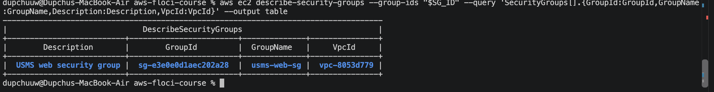

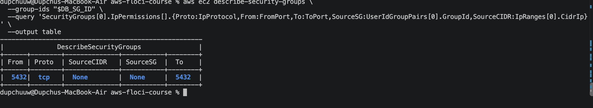

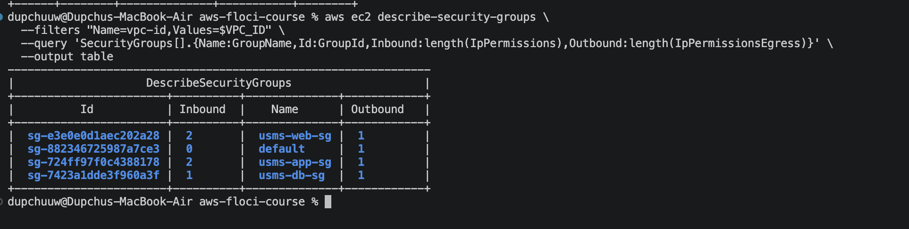


### 4.5 Network ACL

The custom network ACL `usms-private-nacl` was associated with the private subnet. It allows PostgreSQL traffic from the VPC, ephemeral inbound return traffic, ephemeral outbound traffic to the VPC, and HTTPS outbound traffic for operating-system updates. Traffic not matching an explicit rule reaches the implicit deny rule.

Unlike security groups, network ACLs are stateless. Therefore, both directions must be configured for a connection to work.

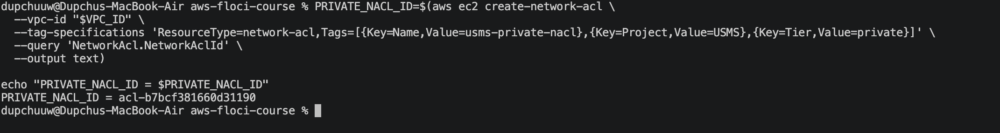

### 4.6 NAT Gateway and S3 Endpoint

The NAT gateway `usms-nat` was launched in public subnet A and Elastic IP was allotted to the same. The default traffic from the private route table was set to be routed to this NAT gateway. It allows private instances to establish outgoing connections while rejecting all incoming connections from the internet.

Gateway VPC endpoint `usms-s3-endpoint` was linked to the private route table. The requests to S3 can hence take the AWS internal endpoint path without going through the NAT gateway and the internet path.

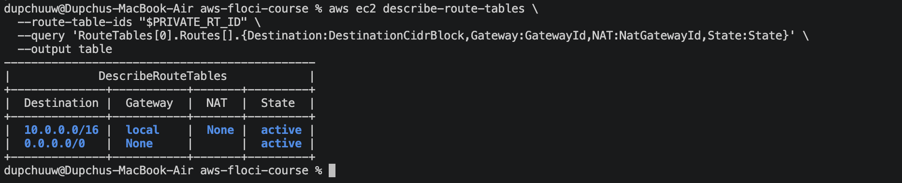

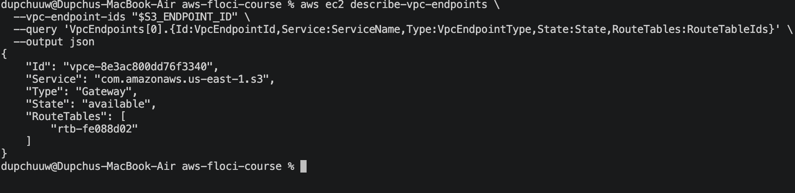

### 4.7 Tags and Persistence

Resources were tagged with `Project=USMS` and descriptive `Name` values. The tag audit was used to verify that the expected resources were discoverable by project tag.

The Floci container was stopped and started again. The VPC was then found by its tag, and the VPC ID, subnet count, and security-group count were compared with the values recorded before the restart. The values remained unchanged, proving that the network state was persistent.

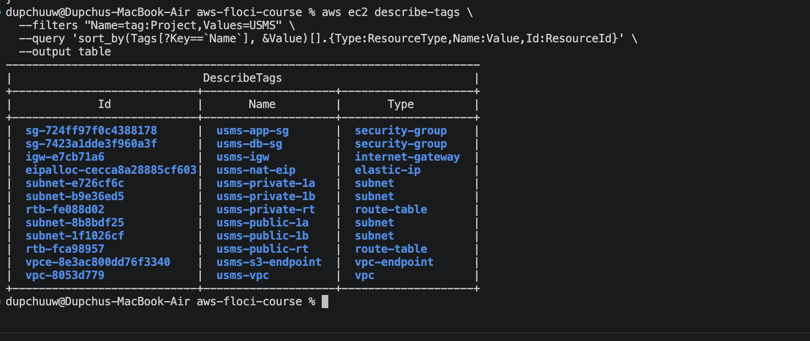

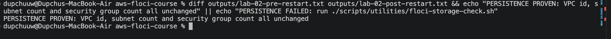

## 5. Verification Results

The verification script checked the environment, Lab 1 dependencies, VPC configuration, subnet settings, route tables, security groups, network ACL, S3 endpoint, tags, report files, and Git hygiene.

**Verification result:**

```text
PASS=33  FAIL=0
```

The most important checks were:

- The VPC CIDR is `10.0.0.0/16`.
- DNS hostnames are enabled.
- The internet gateway is attached to the correct VPC.
- The public subnet auto-assigns public IP addresses.
- The private subnet does not auto-assign public IP addresses.
- The public route table uses the internet gateway.
- The private route table does not use an internet gateway.
- The database security group uses an application security-group source.
- The private NACL is not the default ACL and is associated with the private subnet.
- No output or credential file is tracked by Git.

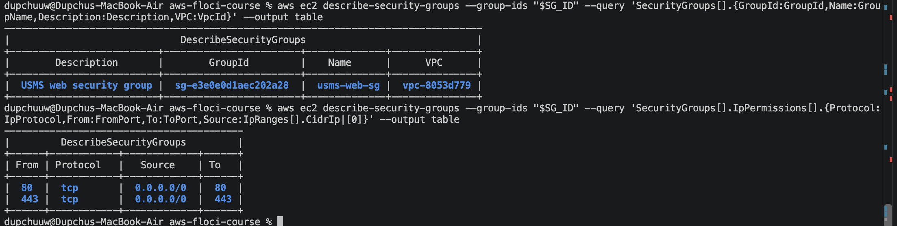

## 6. Independent Exercises

### Exercise 1: Create a Third Public Subnet

`usms-public-subnet-c` was created with CIDR `10.0.5.0/24` in `us-east-1c`. It was tagged as a public USMS subnet, configured to auto-assign public IPv4 addresses, and associated with `usms-public-rt`.

This exercise demonstrated that the public route table can be shared by public subnets in different Availability Zones. The subnet was later removed as practice cleanup.

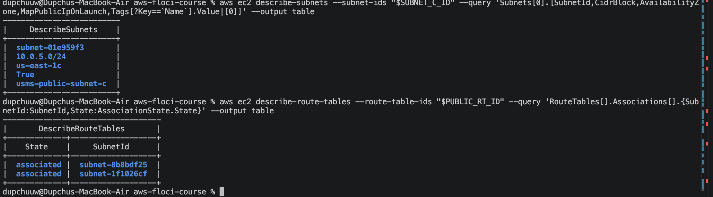

### Exercise 2: Bastion Security Group

The bastion security group `usms-bastion-sg` was created for a future jump host. It allows SSH only from a single trusted `/32` address. The SSH rule on `usms-app-sg` was changed from the broad VPC CIDR to a source reference to `usms-bastion-sg`.

This is more restrictive because administrative access must first pass through the bastion host. The old CIDR-based SSH rule was removed after the group-referenced rule was added.

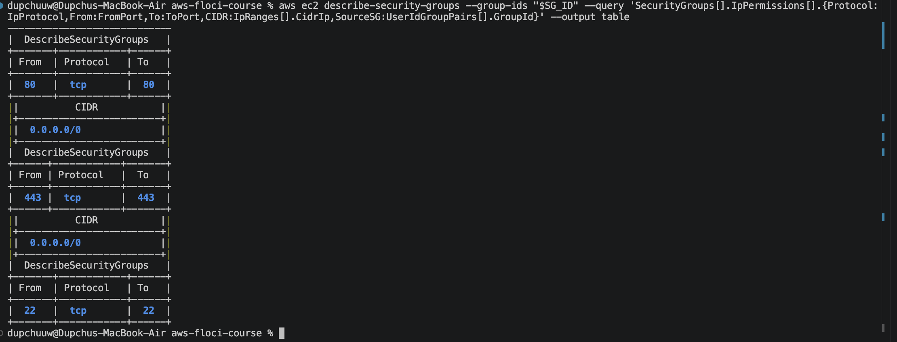

### Exercise 3: Network Report Script

The required script was designed to inspect each subnet and derive its classification from the associated route table rather than from its name or tags.
The script should:

- Be functional from any directory.
- Find the VPC and subnets using tagging and filtering.
- Determine the location of the repository root by `BASH_SOURCE`.
- Output `PUBLIC` if the default route is attached to an internet gateway.
- Output `PRIVATE` if the default route is attached to a NAT gateway.
- Output `ISOLATED` if no default route exists.
- Include `set -uo pipefail` and no hardcoded resource ids.

Example output format:

```text
usms-public-subnet-a   10.0.1.0/24  us-east-1a  PUBLIC   via igw-xxxxxxxx
usms-private-subnet-a  10.0.3.0/24  us-east-1a  PRIVATE  via nat-xxxxxxxx
usms-private-subnet-b  10.0.4.0/24  us-east-1b  ISOLATED no default route
```


### Exercise 4: Exam-Results Service Design

The exam-results service should be placed in a private subnet, preferably `usms-private-subnet-b` to distribute resources across Availability Zones. It must not have a route to the internet gateway and must not receive public IP addresses.

The following security groups are appropriate:

1. `usms-exam-sg` for the exam-results service.
	- Allow the service port from the campus CIDR `10.10.0.0/16`, because staff access arrives through the VPN.
	- Allow TCP `5432` to the database using a source reference to `usms-db-sg`, if the service is the client of the database connection.
	- Allow outbound HTTPS for security patches, using the existing default outbound behavior or an explicitly documented restricted rule.

2. Modify `usms-db-sg` to allow TCP `5432` from `usms-exam-sg`, because the database must accept connections from the new service.

No changes to NACL are needed if the current private NACL already permits the required return path for PostgreSQL and HTTPS. Only a restriction at a subnet level would justify a change to NACL, which is above the security group restrictions.

The existing NAT gateway may be used. A NAT gateway is cheaper, but it introduces an Availability Zone dependency: the failure of `us-east-1a` leads to loss of outbound access by the private resources dependent on it. Adding another NAT gateway in `us-east-1b` increases availability and decreases AZ dependency but incurs extra cost per hour and per GB of processed data. The precise current price per region needs to be recorded from the AWS NAT Gateway pricing page before submission:


The practice subnet `usms-public-subnet-c` must be removed after disassociation from the public route table. The removal procedure is:

```text
What will be deleted: usms-public-subnet-c and its route-table association.
What depends on it: any test resources created in the subnet.
Reversible?: No, recreation is needed if necessary.
Effect on later labs: none, as Lab 3 uses subnet A. 
```

The `usms-exam-sg` security-group portion of this exercise was implemented without creating a new VPC.

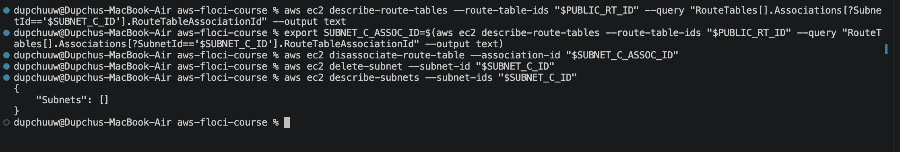`

### Exercise 5: Complete the Second Private Availability Zone

The `usms-private-subnet-b` subnet was created using the CIDR `10.0.4.0/24` in the `us-east-1b` region. It was then associated with `usms-private-rt`, and the default NACL association for the subnet was changed to `usms-private-nacl`.

The subnet was created with the `usms-developer-role` being active, and the temporary credentials were cleared right after its creation. This way, the short session of assuming role will not expire in the following lab steps.

The environment file was regenerated and checked to confirm that `USMS_PRIVATE_SUBNET_B` was populated.

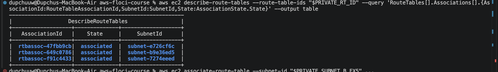

## 7. Review Questions

### 1. What makes a subnet public?

A public subnet refers to a subnet with a valid route table with a default route of `0.0.0.0/0`, with the internet gateway being the target. The name/tag has no impact on the networking of the subnet. A public IP auto-assignment will not create any routes either.

### 2. How do security groups and network ACLs differ?

For instance, the browser can communicate with the web server through TCP port 443 and then the web server communicates with the database using TCP port 5432. Since security groups are stateful, once the communication is allowed, the return traffic is also automatically allowed. However, for network ACLs, since they are stateless, both inbound and outbound rules have to be defined. I will usually begin by defining the security groups because they work at the level of the instance interface and use security group references.

### 3. Why use a security-group reference for the database?

CIDR rules will get out-of-date if instances get moved to another subnet or there is a re-addressing of the infrastructure. On the other hand, a security-group reference stays connected to the application tier even after replacing, scaling, or relocating instances.

### 4. Why is the NAT gateway in the public subnet?

For the NAT gateway to do its job and convert traffic for the private instances, it requires both a route to the internet gateway and an Elastic IP address. In case the first availability zone is down, a private subnet in availability zone B which depends only on one NAT gateway will lose internet connectivity.

### 5. What does the S3 gateway endpoint change?

In case of the endpoint, traffic between the S3 service and the private network takes place using the endpoint route linked to the private route table. In case there is no endpoint, the request uses the private default route and then makes use of the public path in order to reach the S3 service.

### 6. What did the persistence test prove?

Checking whether the VPC was still there after a restart of Floci through the VPC lookup by its tag demonstrated the persistence of the VPC in the emulator's persistent data storage. Using the existing shell variable would merely prove that the shell had stored the previous value of the string.

### 7. How can security-group rules be assessed in Floci?

The Floci implementation holds and retrieves the security groups and rules even though it does not filter packets like AWS does. The correctness of the code can be evaluated by looking at the rules configuration itself. The checker would identify that there was an invalid database rule configured with a CIDR instead of a group name. The checker could not catch any packet flow errors.

## 8. Conclusion

Lab 02 built the foundation of the USMS network. The implemented configuration includes public subnets for websites with internet-gateway routing, private subnets for databases with NAT routing, security groups for instance-level access control, a private network ACL as a subnet-level fall-back access control, and S3 gateway endpoint for access to AWS services.

This setup was tested using the AWS CLI and a restart of the Floci container. The network resources' IDs were stored in `configs/lab-02.env`, making it possible for future labs to reuse the created VPC, subnet, routing tables, security groups, NACL, NAT, and endpoints.


